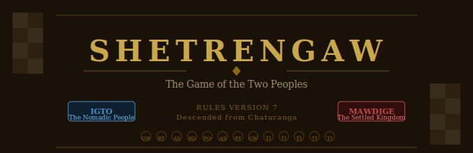
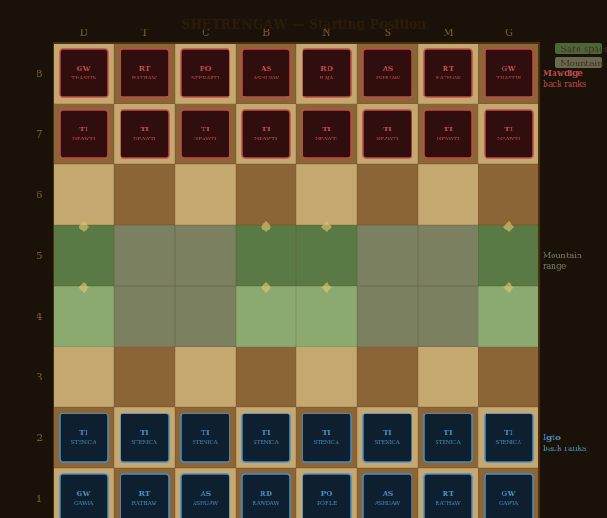
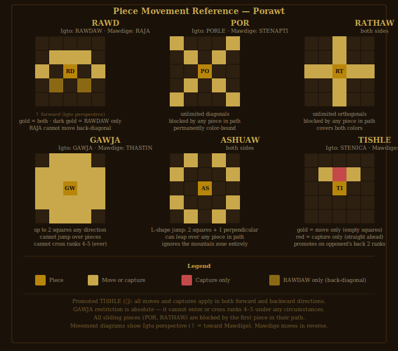

# SHETRENGAW
### The Game of the Two Peoples

SHETRENGAW is a two-player strategy game descended from the ancient game
of Chaturanga. It was invented by the Sto — a people who began as nomads
moving across the ancient world and who, over six centuries, transformed
into something no one who knew them at the beginning could have predicted.
The game encodes both identities: the Igto represent the nomadic Sto, the
Mawdige their settled rivals. To play a full session of SHETRENGAW, each
player must inhabit both sides of that history. There is no way to play
only one.

The game spread from campfires to courts. As the Sto grew in power and
influence, SHETRENGAW traveled with them — and changed. What had been
played with river stones and carved wood became a court game with pieces
of cast bronze and carved jade, inlaid with amber and lapis lazuli.
The SHETRENGAW academy developed to study, record, and occasionally amend
the rules. The two-round session structure — each player experiencing both
sides before a winner is named — was not in the original game. It was a
convention that emerged from centuries of play, from children arguing over
who had to be the Mawdige, and from the slow recognition that the game
was only fully understood when you had lost as both peoples.

---

## The Game

SHETRENGAW is asymmetric by design. The two sides have different pieces,
different win conditions, and a different relationship with the scoring
system. This asymmetry is not a flaw. It is the soul of the game.

A full session consists of two rounds. Players swap sides between rounds
so that each player experiences both perspectives. Combined scores across
both rounds determine the session winner — meaning a player who loses both
rounds can still win the session by losing well.

---

## How to Play

Full rules are in the [rulebook](rules/Shetrengaw_Rulebook_v7.docx).

**The five actions available each turn:**

| Action | Sto Term | Effect |
|--------|----------|--------|
| Move | Vedux | Move a piece to a legal empty square |
| Topple | Oniawxt | Capture an enemy piece — goes to your jail |
| Kill | Nineut | Remove an enemy piece permanently |
| Shelter | Dawminia | Move a piece into a mountain safe space |
| Drop | Pawrawt | Return a jailed piece to the board |

**Key rules at a glance:**
- Mawdige moves first
- The GAWJA cannot cross ranks 4–5 under any circumstances
- Igto wins by capturing the RAJA, or by keeping it in check for
  3 consecutive turns (Persistent Pursuit)
- Mawdige wins by capturing the RAWDAW and then 2 additional pieces
- Jail Break Loss: if your pieces on the board fall below your pieces
  held in the enemy's jail, you lose immediately

---

## Play in Your Browser

Download
[`game_files/shetrengaw_html/shetrengaw_v7_stg.html`](game_files/shetrengaw_html/shetrengaw_v7_stg.html)
and open it in any browser. No installation required. Supports both
friendly and competitive scoring. Generates a `.stg` game record file
at the end of each session.

---

## The Pieces

The court set shown here represents two traditions of craftsmanship
separated by culture and material. The Igto pieces are cast bronze with
warm gold patina, inlaid with polished amber. The Mawdige pieces are
carved dark jade with silver wire inlay, set with lapis lazuli.
The forms are the same. Only the material distinguishes sides —
and the elephant's trunk.

### Igto — Bronze and Amber

| Piece | Name | Role |
|-------|------|------|
| STENICA | Infantry | Advances forward, captures straight ahead |
| ASHUAW | Horse | L-shape jump, leaps over pieces |
| GAWJA | Elephant | Up to 2 squares any direction, cannot cross the mountain |
| PORLE | Tactician | Unlimited diagonals, color-bound |
| RAWDAW | Chieftain | 1 square: forward, diagonal, sideways, back-diagonal |
| RATHAW | Chariot | Unlimited orthogonals |

### Mawdige — Dark Jade and Lapis

| Piece | Name | Role |
|-------|------|------|
| NPAWTI | Infantry | Same as STENICA |
| ASHUAW | Horse | Same as Igto ASHUAW |
| THASTIN | Elephant | Same as GAWJA — trunk raised |
| STENAPTI | Tactician | Same as PORLE |
| RAJA | King | Forward, diagonal, sideways only — no back-diagonal |
| RATHAW | Chariot | Same as Igto RATHAW |

---

## Game Records

After completing a session, the game generates a `.stg` file — a JSON
record of results, scores, win conditions, and key events. The format
records the rules version so older records remain interpretable as the
game evolves.

If you play a memorable game, feel free to share your `.stg` file in
[Discussions](../../discussions).

---

## Repository Structure

    shetrengaw/
    ├── README.md
    ├── game_files/
    │   ├── 3d_files/
    │   ├── images/
    │   │   ├── shetrengaw_header.svg
    │   │   ├── shetrengaw_board.svg
    │   │   ├── shetrengaw_pieces.svg
    │   │   └── (piece images)
    │   └── shetrengaw_html/
    │       └── shetrengaw_v7_stg.html
    ├── lore/
    └── rules/
        └── Shetrengaw_Rulebook_v7.docx

---

## Visual Inspiration

The court set's aesthetic is inspired by ancient bronze figurative
traditions from South Asia, West Africa, and the ancient Near East.
The game itself is descended from Chaturanga, the ancient Indian
strategy game that also gave rise to Chess, Shogi, and Makruk.

---

## Rules Version

Current rules: **v7**  
The HTML game file and rulebook are both current.  
Rule changes increment the version number.  
Aesthetic and functional changes to the HTML do not.

---

*May your game reveal what histories always knew.*